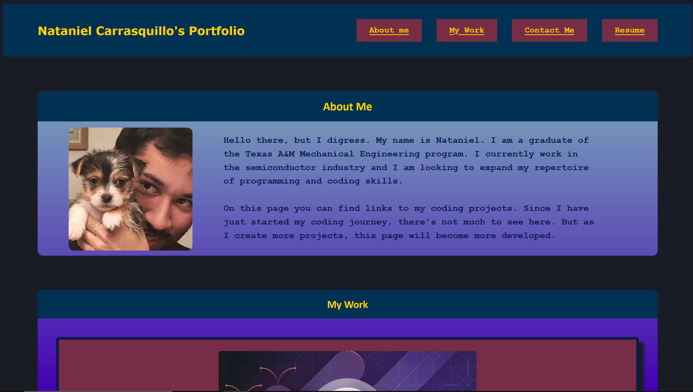
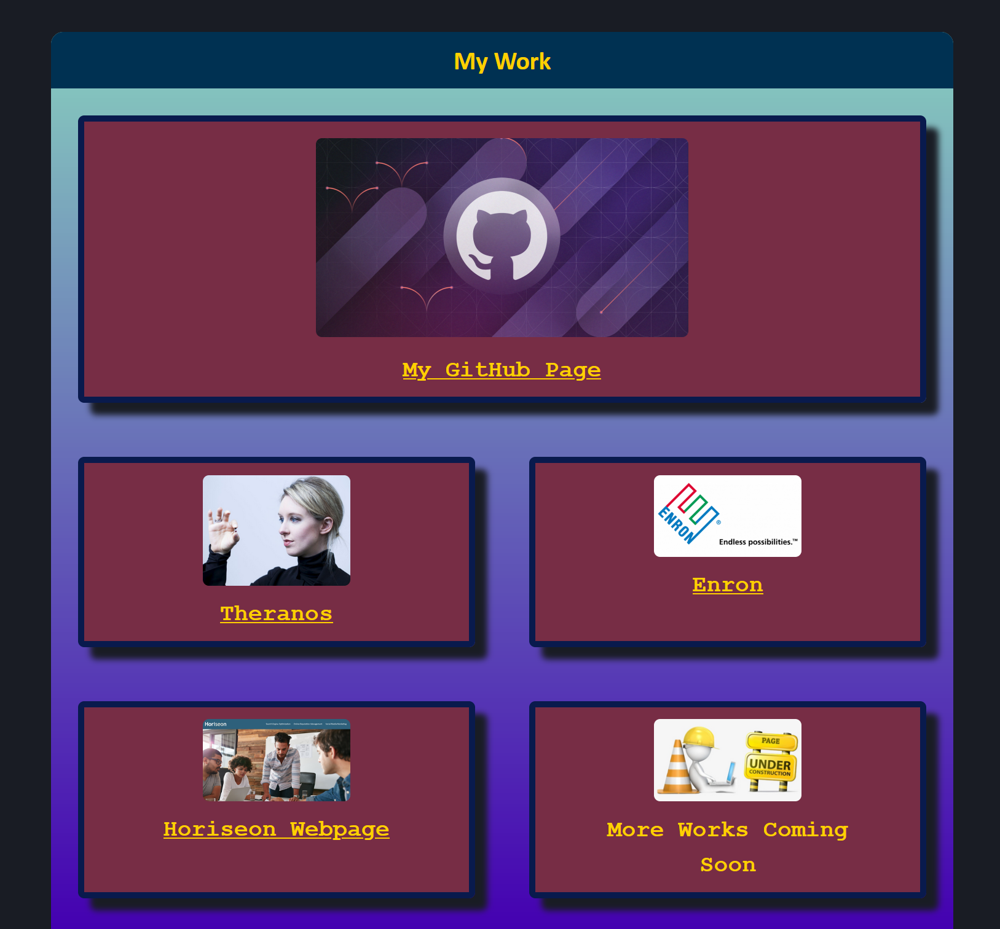
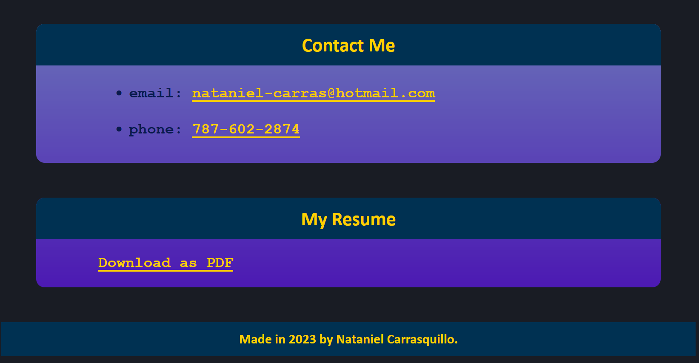

# Professional Portfolio

## Description:
The purpose of this code is to create a professional portfolio website that showcases different coding projects made by me, Nataniel Carrasquillo.

## Website Link:

https://nataniel-c.github.io/professional-portfolio

## Website Screenshots:

---

---

---